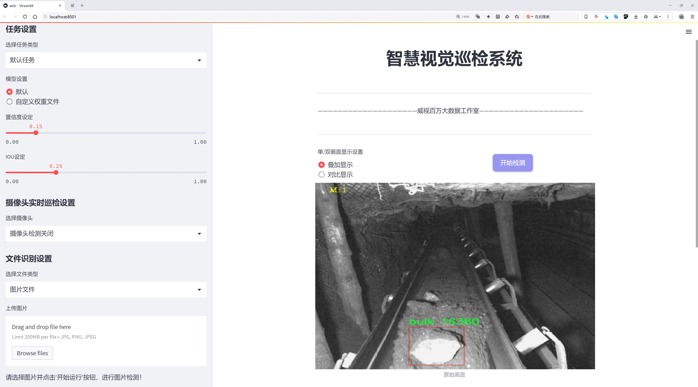
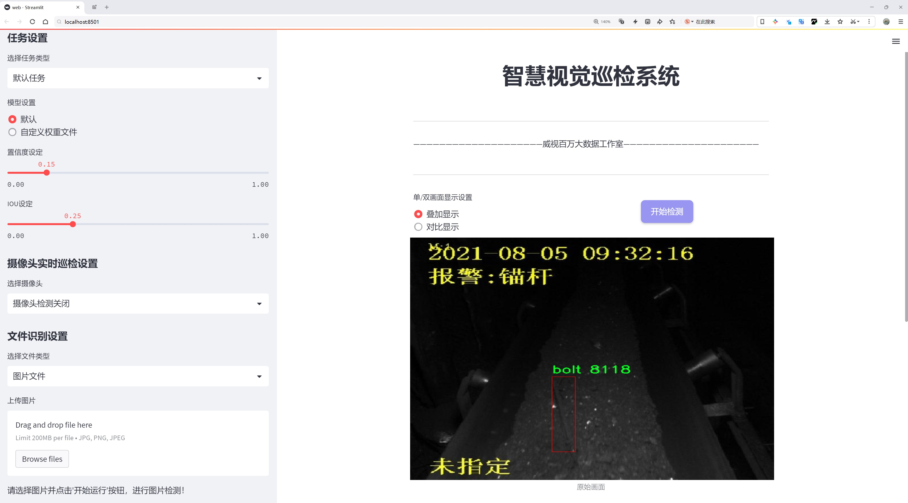
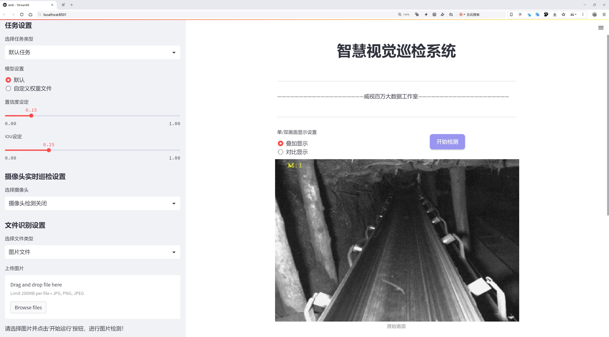
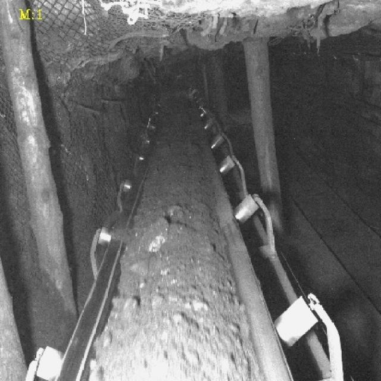
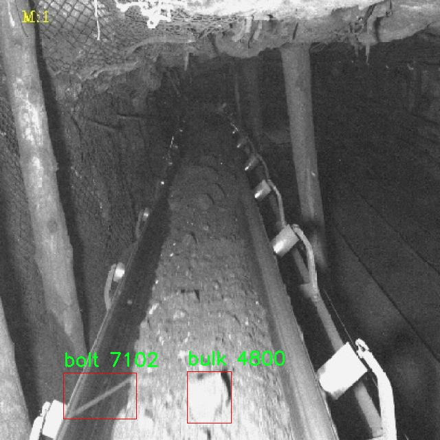
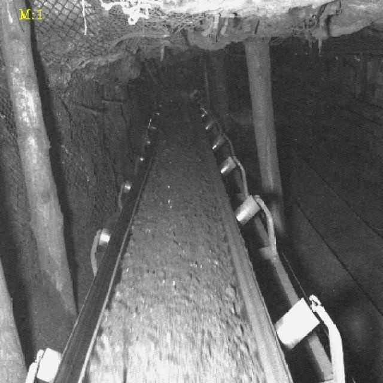
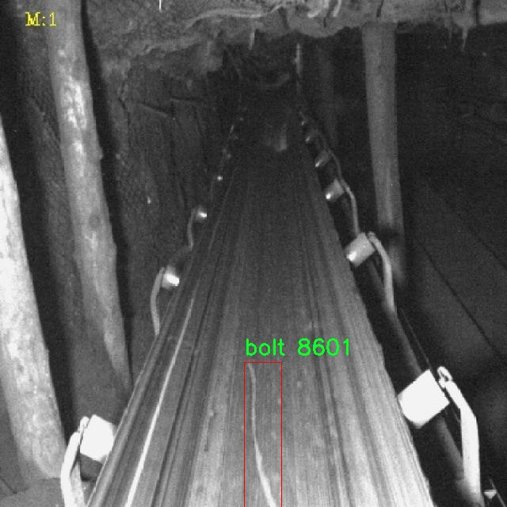
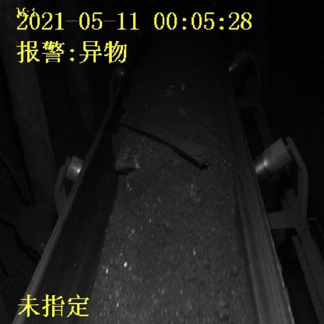

# 螺栓与散装物体检测检测系统源码分享
 # [一条龙教学YOLOV8标注好的数据集一键训练_70+全套改进创新点发刊_Web前端展示]

### 1.研究背景与意义

项目参考[AAAI Association for the Advancement of Artificial Intelligence](https://gitee.com/qunshansj/projects)

项目来源[AACV Association for the Advancement of Computer Vision](https://gitee.com/qunmasj/projects)

研究背景与意义

随着工业自动化和智能制造的迅速发展，物体检测技术在各类生产和物流环节中扮演着越来越重要的角色。尤其是在螺栓和散装物体的检测领域，传统的人工检测方法不仅效率低下，而且容易受到人为因素的影响，导致误判和漏判的情况频繁发生。因此，开发一种高效、准确的自动检测系统显得尤为重要。近年来，深度学习技术的飞速发展为物体检测提供了新的解决方案，其中YOLO（You Only Look Once）系列模型因其高效性和实时性受到广泛关注。YOLOv8作为该系列的最新版本，具备了更强的特征提取能力和更快的推理速度，为螺栓与散装物体的检测提供了良好的基础。

在本研究中，我们基于改进的YOLOv8模型，构建了一套专门针对螺栓与散装物体的检测系统。数据集的构建是该系统成功的关键因素之一。我们所使用的数据集包含3100张图像，涵盖了两类物体：螺栓和散装物体。这一数据集不仅数量充足，而且多样性强，能够有效地反映出实际应用场景中的各种情况，包括不同的光照条件、背景复杂度以及物体的不同姿态和尺寸。这为模型的训练和验证提供了丰富的样本，有助于提高检测的准确性和鲁棒性。

在实际应用中，螺栓作为连接和固定的重要部件，其检测的准确性直接影响到产品的质量和安全性。而散装物体的检测则在物流、仓储等领域具有重要意义，能够有效提高物料管理的效率。因此，基于YOLOv8的检测系统不仅具有理论研究的价值，更具备广泛的实际应用前景。通过对该系统的研究，我们希望能够在提高检测精度的同时，降低检测时间，为工业生产提供更为高效的解决方案。

此外，随着人工智能技术的不断进步，物体检测的应用范围也在不断扩展。我们的研究不仅限于螺栓与散装物体的检测，还可以为其他类型物体的检测提供借鉴。通过对YOLOv8模型的改进，我们可以探索其在更复杂场景下的应用潜力，为未来的研究奠定基础。

综上所述，基于改进YOLOv8的螺栓与散装物体检测系统的研究，不仅具有重要的学术价值，还能为实际工业应用提供切实可行的解决方案。通过这一研究，我们期望能够推动物体检测技术的发展，为智能制造和工业自动化的实现贡献力量。

### 2.图片演示







##### 注意：由于此博客编辑较早，上面“2.图片演示”和“3.视频演示”展示的系统图片或者视频可能为老版本，新版本在老版本的基础上升级如下：（实际效果以升级的新版本为准）

  （1）适配了YOLOV8的“目标检测”模型和“实例分割”模型，通过加载相应的权重（.pt）文件即可自适应加载模型。

  （2）支持“图片识别”、“视频识别”、“摄像头实时识别”三种识别模式。

  （3）支持“图片识别”、“视频识别”、“摄像头实时识别”三种识别结果保存导出，解决手动导出（容易卡顿出现爆内存）存在的问题，识别完自动保存结果并导出到tempDir中。

  （4）支持Web前端系统中的标题、背景图等自定义修改，后面提供修改教程。

  另外本项目提供训练的数据集和训练教程,暂不提供权重文件（best.pt）,需要您按照教程进行训练后实现图片演示和Web前端界面演示的效果。

### 3.视频演示

[3.1 视频演示](https://www.bilibili.com/video/BV1tGtRehEPX/)

### 4.数据集信息展示

##### 4.1 本项目数据集详细数据（类别数＆类别名）

nc: 2
names: ['bolt', 'bulk']


##### 4.2 本项目数据集信息介绍

数据集信息展示

在本研究中，我们采用了名为“meikuang”的数据集，以改进YOLOv8在螺栓与散装物体检测系统中的性能。该数据集专门设计用于支持对特定物体的识别与分类，包含两类物体：螺栓（bolt）和散装物体（bulk）。这两类物体在工业生产和物流管理中具有重要的应用价值，因此，构建一个高效的检测系统对于提升生产效率和减少人工成本具有显著意义。

“meikuang”数据集的构建过程遵循了严格的标准，以确保数据的多样性和代表性。数据集中包含了大量的图像，这些图像来源于不同的场景和环境，以模拟实际应用中的各种情况。螺栓的图像涵盖了不同类型、尺寸和颜色的螺栓，确保模型能够学习到螺栓在各种条件下的特征。同时，散装物体的图像则包括了不同形状、大小和材质的物体，确保模型在面对多样化的散装物体时，能够准确地进行识别。

为了增强数据集的实用性，数据集中还包含了不同光照条件、背景复杂度和视角的图像。这种多样性使得模型在训练过程中能够更好地适应现实世界中的变化，提升其泛化能力。此外，数据集中的每一张图像都经过精确的标注，确保了每个物体的边界框和类别信息的准确性。这一过程不仅提高了数据集的质量，也为后续的模型训练提供了坚实的基础。

在进行YOLOv8模型的训练时，我们将“meikuang”数据集分为训练集和验证集，以便在训练过程中监控模型的性能并进行必要的调整。训练集用于模型的学习，而验证集则用于评估模型在未见数据上的表现。这种划分策略有助于防止模型的过拟合现象，确保其在实际应用中的可靠性。

在训练过程中，我们采用了一系列数据增强技术，如随机裁剪、旋转、缩放和颜色变换等，以进一步提升模型的鲁棒性。这些技术不仅增加了训练样本的多样性，还使得模型能够更好地适应不同的场景和条件。此外，我们还进行了超参数的调优，以找到最佳的学习率、批量大小和网络结构配置，从而最大限度地提升模型的检测精度。

经过多轮的训练与验证，我们期望改进后的YOLOv8模型能够在螺栓与散装物体的检测任务中实现更高的准确率和更快的推理速度。这将为工业自动化、仓储管理和物流运输等领域带来更高效的解决方案。通过对“meikuang”数据集的深入分析与应用，我们相信能够推动物体检测技术的发展，为相关行业的智能化转型提供有力支持。











### 5.全套项目环境部署视频教程（零基础手把手教学）

[5.1 环境部署教程链接（零基础手把手教学）](https://www.ixigua.com/7404473917358506534?logTag=c807d0cbc21c0ef59de5)


[5.2 安装Python虚拟环境创建和依赖库安装视频教程链接（零基础手把手教学）](https://www.ixigua.com/7404474678003106304?logTag=1f1041108cd1f708b01a)

### 6.手把手YOLOV8训练视频教程（零基础小白有手就能学会）

[6.1 手把手YOLOV8训练视频教程（零基础小白有手就能学会）](https://www.ixigua.com/7404477157818401292?logTag=d31a2dfd1983c9668658)

### 7.70+种全套YOLOV8创新点代码加载调参视频教程（一键加载写好的改进模型的配置文件）

[7.1 70+种全套YOLOV8创新点代码加载调参视频教程（一键加载写好的改进模型的配置文件）](https://www.ixigua.com/7404478314661806627?logTag=29066f8288e3f4eea3a4)

### 8.70+种全套YOLOV8创新点原理讲解（非科班也可以轻松写刊发刊，V10版本正在科研待更新）

由于篇幅限制，每个创新点的具体原理讲解就不一一展开，具体见下列网址中的创新点对应子项目的技术原理博客网址【Blog】：


[8.1 70+种全套YOLOV8创新点原理讲解链接](https://gitee.com/qunmasj/good)

### 9.系统功能展示（检测对象为举例，实际内容以本项目数据集为准）

图9.1.系统支持检测结果表格显示

  图9.2.系统支持置信度和IOU阈值手动调节

  图9.3.系统支持自定义加载权重文件best.pt(需要你通过步骤5中训练获得)

  图9.4.系统支持摄像头实时识别

  图9.5.系统支持图片识别

  图9.6.系统支持视频识别

  图9.7.系统支持识别结果文件自动保存

  图9.8.系统支持Excel导出检测结果数据


### 10.原始YOLOV8算法原理

原始YOLOv8算法原理

YOLOv8（You Only Look Once version 8）作为目标检测领域的最新进展，代表了YOLO系列算法的又一次重要演变。该算法在设计上致力于实现更高的检测精度和更快的推理速度，适应现代计算环境的需求。YOLOv8的架构主要由输入层、主干网络、颈部网络和头部网络四个核心组件构成，每个部分都在目标检测的整体性能中扮演着不可或缺的角色。

在输入层，YOLOv8对输入图像进行了一系列预处理操作，包括Mosaic数据增强、自适应图片缩放和灰度填充等。这些操作不仅提升了模型对多样化数据的适应能力，还增强了训练过程中样本的多样性，从而提高了模型的泛化能力。经过这些预处理后，图像被缩放至指定的输入尺寸，以确保后续处理的高效性和准确性。

主干网络是YOLOv8的特征提取核心，采用了多层卷积操作，通过下采样逐步提取图像的特征信息。每个卷积层中都包含批归一化和SiLUR激活函数，这些设计不仅加速了模型的收敛速度，还有效地缓解了梯度消失的问题。为了进一步增强特征提取的能力，YOLOv8引入了C2f块，这一模块借鉴了YOLOv7中的E-ELAN结构，通过跨层分支连接来增强模型的梯度流动，从而改善了检测结果的准确性。主干网络的末尾使用了SPPFl块，结合三个最大池化层来处理多尺度特征，提升了网络对不同尺度目标的感知能力，进一步增强了特征的抽象能力。

颈部网络则是YOLOv8中至关重要的特征融合部分。它利用FPNS（Feature Pyramid Network）和PAN（Path Aggregation Network）结构，将来自主干网络的不同尺度特征图进行有效融合。这一过程通过上采样和下采样操作，确保了不同层次特征的有效传递，使得模型能够综合考虑多种尺度的信息，从而提高检测的准确性和鲁棒性。

在输出端，YOLOv8采用了解耦的检测头设计。通过两个并行的卷积分支，分别计算回归和类别的损失，这种解耦的方式使得模型在处理复杂场景时，能够更好地平衡目标的定位和分类任务。输出端的设计不仅提升了模型的灵活性，还有效降低了计算复杂度。为了进一步优化损失计算，YOLOv8采用了Task-Aligned Assigner方法，对分类分数和回归分数进行加权，以实现更为精准的正样本匹配。此外，分类损失使用了二元交叉熵（BCE）计算，而回归损失则采用了分布聚焦损失（DFL）和完全交并比（CIoU）损失函数，确保了模型在不同任务上的表现均衡。

YOLOv8的设计理念在于实现更高的检测精度和更快的推理速度。与以往的anchor-based检测方法相比，YOLOv8采用了anchor-free的策略，这一转变使得模型在处理复杂背景和小目标时表现出色。然而，在实际应用中，YOLOv8仍然面临一些挑战，尤其是在复杂水面环境下，因小目标漂浮物特征复杂、背景多样，模型可能出现定位误差和对目标感知能力不足的问题。为了解决这些问题，研究者们提出了YOLOv8-WSSOD算法，通过引入BiFormer双层路由注意力机制，增强主干网络对特征的提取能力，同时添加更小的检测头以提升对小目标的感知力，并在Neck端引入GSConv和Slim-neck技术，以保持精度并降低计算量。

总的来说，YOLOv8算法通过精心设计的网络结构和创新的损失计算方法，在目标检测领域树立了新的标杆。其高效的特征提取、灵活的特征融合以及解耦的输出设计，使得YOLOv8在处理多样化的目标检测任务时，展现出了优越的性能。随着对YOLOv8的深入研究和应用，未来的目标检测技术将更加智能化和高效化，推动计算机视觉领域的进一步发展。


### 11.项目核心源码讲解（再也不用担心看不懂代码逻辑）

#### 11.1 ui.py

以下是经过简化和注释的核心代码：

```python
import sys
import subprocess

def run_script(script_path):
    """
    使用当前 Python 环境运行指定的脚本。

    Args:
        script_path (str): 要运行的脚本路径
    """
    # 获取当前 Python 解释器的路径
    python_path = sys.executable

    # 构建运行命令，使用 streamlit 运行指定的脚本
    command = f'"{python_path}" -m streamlit run "{script_path}"'

    # 执行命令并等待其完成
    result = subprocess.run(command, shell=True)
    
    # 检查命令执行结果，如果返回码不为0，表示出错
    if result.returncode != 0:
        print("脚本运行出错。")

# 主程序入口
if __name__ == "__main__":
    # 指定要运行的脚本路径
    script_path = "web.py"  # 假设脚本在当前目录下

    # 调用函数运行脚本
    run_script(script_path)
```

### 代码分析与注释：
1. **导入模块**：
   - `sys`：用于获取当前 Python 解释器的路径。
   - `subprocess`：用于执行外部命令。

2. **`run_script` 函数**：
   - 该函数接受一个脚本路径作为参数，并使用当前 Python 环境运行该脚本。
   - 使用 `sys.executable` 获取当前 Python 解释器的路径。
   - 构建一个命令字符串，使用 `streamlit` 模块运行指定的脚本。
   - 使用 `subprocess.run` 执行命令，并等待其完成。
   - 检查命令的返回码，如果不为0，则输出错误信息。

3. **主程序入口**：
   - 使用 `if __name__ == "__main__":` 确保只有在直接运行该脚本时才会执行以下代码。
   - 指定要运行的脚本路径（在此例中为 `"web.py"`）。
   - 调用 `run_script` 函数来执行指定的脚本。 

这个简化后的代码保留了核心功能，并且通过注释解释了每个部分的作用。

这个程序文件名为 `ui.py`，其主要功能是通过当前的 Python 环境运行一个指定的脚本，具体来说是一个名为 `web.py` 的脚本。文件中首先导入了必要的模块，包括 `sys`、`os` 和 `subprocess`，以及一个自定义的函数 `abs_path`，该函数来自于 `QtFusion.path` 模块，可能用于获取文件的绝对路径。

在 `run_script` 函数中，程序接受一个参数 `script_path`，这个参数是要运行的脚本的路径。函数内部首先获取当前 Python 解释器的路径，使用 `sys.executable` 来实现。接着，构建一个命令字符串，该命令使用当前的 Python 解释器和 `streamlit` 模块来运行指定的脚本。`streamlit` 是一个用于构建数据应用的库，因此可以推测 `web.py` 可能是一个用于展示数据的应用。

然后，使用 `subprocess.run` 方法来执行构建好的命令。这个方法会在一个新的 shell 中运行命令，并等待其完成。如果命令执行的返回码不为零，表示脚本运行过程中出现了错误，程序会打印出“脚本运行出错”的提示。

在文件的最后部分，使用 `if __name__ == "__main__":` 语句来确保只有在直接运行 `ui.py` 时才会执行后面的代码。这里指定了要运行的脚本路径为 `web.py`，并调用 `run_script` 函数来执行该脚本。

总体来说，这个文件的主要作用是作为一个启动器，通过命令行运行一个基于 Streamlit 的 Python 脚本，便于用户在命令行环境中快速启动和调试数据应用。

#### 11.2 70+种YOLOv8算法改进源码大全和调试加载训练教程（非必要）\ultralytics\models\yolo\pose\__init__.py

以下是代码中最核心的部分，并附上详细的中文注释：

```python
# 导入必要的模块
from .predict import PosePredictor  # 导入姿态预测器类
from .train import PoseTrainer      # 导入姿态训练器类
from .val import PoseValidator       # 导入姿态验证器类

# 定义模块的公开接口
__all__ = 'PoseTrainer', 'PoseValidator', 'PosePredictor'  # 指定可以被外部访问的类
```

### 注释说明：
1. **导入模块**：
   - `from .predict import PosePredictor`：从当前包的 `predict` 模块中导入 `PosePredictor` 类，该类负责进行姿态预测。
   - `from .train import PoseTrainer`：从当前包的 `train` 模块中导入 `PoseTrainer` 类，该类用于训练姿态模型。
   - `from .val import PoseValidator`：从当前包的 `val` 模块中导入 `PoseValidator` 类，该类用于验证姿态模型的性能。

2. **公开接口**：
   - `__all__` 是一个特殊变量，用于定义模块的公共接口。这里指定了 `PoseTrainer`、`PoseValidator` 和 `PosePredictor` 三个类可以被外部导入和使用。这意味着当用户使用 `from module_name import *` 时，只会导入这三个类。

这个程序文件是Ultralytics YOLO项目中的一个初始化文件，文件名为`__init__.py`，位于`ultralytics/models/yolo/pose/`目录下。该文件的主要作用是定义模块的公共接口，便于其他模块或文件导入使用。

在文件的开头，有一行注释`# Ultralytics YOLO 🚀, AGPL-3.0 license`，这表明该项目是Ultralytics开发的YOLO（You Only Look Once）系列算法的一部分，并且遵循AGPL-3.0许可证。这意味着用户可以自由使用和修改代码，但在分发修改后的版本时，必须遵循相同的许可证。

接下来，文件通过`from`语句导入了三个类：`PosePredictor`、`PoseTrainer`和`PoseValidator`。这些类分别负责姿态预测、模型训练和验证。具体来说：

- `PosePredictor`：用于进行姿态估计的预测器，可能包含处理输入数据并生成预测结果的相关方法。
- `PoseTrainer`：用于训练姿态估计模型的训练器，可能包含模型训练的相关逻辑和参数设置。
- `PoseValidator`：用于验证模型性能的验证器，可能包含评估模型在测试集上的表现的方法。

最后，`__all__`变量被定义为一个元组，包含了这三个类的名称。这意味着当使用`from module import *`语句导入该模块时，只会导入`PoseTrainer`、`PoseValidator`和`PosePredictor`这三个类。这是一种封装机制，帮助控制模块的公共接口，避免不必要的内部实现细节被暴露。

总的来说，这个`__init__.py`文件为YOLO的姿态估计模块提供了一个清晰的接口，使得其他部分的代码能够方便地使用这些功能。

#### 11.3 70+种YOLOv8算法改进源码大全和调试加载训练教程（非必要）\ultralytics\hub\session.py

以下是经过简化和注释的核心代码部分：

```python
import signal
import sys
from time import sleep
import requests
from ultralytics.hub.utils import HUB_API_ROOT, HUB_WEB_ROOT, smart_request
from ultralytics.utils import LOGGER, checks, is_colab
from ultralytics.utils.errors import HUBModelError

AGENT_NAME = f'python-{__version__}-colab' if is_colab() else f'python-{__version__}-local'

class HUBTrainingSession:
    """
    HUBTrainingSession类用于管理Ultralytics HUB YOLO模型的训练会话。
    包括模型初始化、心跳监测和检查点上传等功能。
    """

    def __init__(self, url):
        """
        初始化HUBTrainingSession，设置模型标识符。
        
        参数:
            url (str): 用于初始化HUB训练会话的模型标识符。
        
        异常:
            ValueError: 如果提供的模型标识符无效。
            ConnectionError: 如果连接全球API密钥不被支持。
        """
        # 解析输入的模型URL
        if url.startswith(f'{HUB_WEB_ROOT}/models/'):
            url = url.split(f'{HUB_WEB_ROOT}/models/')[-1]
        if [len(x) for x in url.split('_')] == [42, 20]:
            key, model_id = url.split('_')
        elif len(url) == 20:
            key, model_id = '', url
        else:
            raise HUBModelError(f"model='{url}' not found. Check format is correct.")

        # 授权
        auth = Auth(key)
        self.model_id = model_id
        self.model_url = f'{HUB_WEB_ROOT}/models/{model_id}'
        self.api_url = f'{HUB_API_ROOT}/v1/models/{model_id}'
        self.auth_header = auth.get_auth_header()
        self.metrics_queue = {}  # 用于存储模型的指标
        self.model = self._get_model()  # 获取模型数据
        self.alive = True
        self._start_heartbeat()  # 启动心跳监测
        self._register_signal_handlers()  # 注册信号处理器

    def _register_signal_handlers(self):
        """注册信号处理器以优雅地处理终止信号。"""
        signal.signal(signal.SIGTERM, self._handle_signal)
        signal.signal(signal.SIGINT, self._handle_signal)

    def _handle_signal(self, signum, frame):
        """处理终止信号，停止心跳监测并退出程序。"""
        if self.alive:
            LOGGER.info('Kill signal received! ❌')
            self._stop_heartbeat()
            sys.exit(signum)

    def _stop_heartbeat(self):
        """终止心跳监测循环。"""
        self.alive = False

    def upload_metrics(self):
        """上传模型指标到Ultralytics HUB。"""
        payload = {'metrics': self.metrics_queue.copy(), 'type': 'metrics'}
        smart_request('post', self.api_url, json=payload, headers=self.auth_header)

    def _get_model(self):
        """从Ultralytics HUB获取并返回模型数据。"""
        api_url = f'{HUB_API_ROOT}/v1/models/{self.model_id}'
        try:
            response = smart_request('get', api_url, headers=self.auth_header)
            data = response.json().get('data', None)
            if not data:
                raise ValueError('Dataset may still be processing. Please wait a minute and try again.')
            return data
        except requests.exceptions.ConnectionError:
            raise ConnectionRefusedError('ERROR: The HUB server is not online. Please try again later.')

    def upload_model(self, epoch, weights, is_best=False, map=0.0, final=False):
        """
        上传模型检查点到Ultralytics HUB。
        
        参数:
            epoch (int): 当前训练的轮次。
            weights (str): 模型权重文件的路径。
            is_best (bool): 当前模型是否为最佳模型。
            map (float): 模型的平均精度。
            final (bool): 模型是否为最终模型。
        """
        if Path(weights).is_file():
            with open(weights, 'rb') as f:
                file = f.read()
        else:
            LOGGER.warning(f'Model upload issue. Missing model {weights}.')
            file = None
        
        url = f'{self.api_url}/upload'
        data = {'epoch': epoch}
        if final:
            data.update({'type': 'final', 'map': map})
            smart_request('post', url, data=data, files={'final_model.pt': file}, headers=self.auth_header)
        else:
            data.update({'type': 'epoch', 'isBest': bool(is_best)})
            smart_request('post', url, data=data, files={'last.pt': file}, headers=self.auth_header)

    def _start_heartbeat(self):
        """开始一个线程心跳循环，定期报告代理的状态到Ultralytics HUB。"""
        while self.alive:
            smart_request('post', f'{HUB_API_ROOT}/v1/agent/heartbeat/models/{self.model_id}',
                          json={'agent': AGENT_NAME}, headers=self.auth_header)
            sleep(300)  # 每300秒发送一次心跳
```

### 代码注释说明：
1. **类和方法的功能**：每个类和方法都有注释，说明其功能和参数，便于理解代码的结构和用途。
2. **信号处理**：通过注册信号处理器，确保在接收到终止信号时，能够优雅地停止心跳监测并退出程序。
3. **模型数据获取**：在获取模型数据时，处理了可能的网络异常，确保程序的健壮性。
4. **上传模型**：上传模型检查点的功能被详细描述，明确了参数的意义和使用方式。

这个程序文件是一个用于管理Ultralytics HUB YOLO模型训练会话的Python类，名为`HUBTrainingSession`。它主要负责模型的初始化、心跳监测和检查点上传等功能。

在初始化过程中，构造函数`__init__`接收一个模型标识符`url`，并解析出模型的键和ID。程序会检查输入的格式是否正确，并根据提供的模型标识符进行身份验证。成功解析后，类会生成与Ultralytics HUB的相关URL，并设置一些速率限制和计时器。初始化完成后，程序会启动心跳机制，定期向服务器报告状态。

类中定义了多个方法。`_register_signal_handlers`和`_handle_signal`方法用于处理系统信号，以便在接收到终止信号时优雅地关闭心跳循环。`upload_metrics`方法用于将模型的性能指标上传到Ultralytics HUB。`_get_model`方法则从HUB获取模型数据，并根据模型的状态决定是开始新的训练还是恢复已有的训练。

此外，`upload_model`方法用于将训练过程中生成的模型检查点上传到HUB。它会根据当前的训练轮次和模型的最佳状态进行相应的处理。最后，`_start_heartbeat`方法在一个独立的线程中运行，定期向HUB发送心跳请求，以保持与服务器的连接。

整个类的设计旨在确保与Ultralytics HUB的交互顺畅，并为YOLO模型的训练提供必要的支持和管理功能。通过这些功能，用户可以方便地进行模型训练、监控和上传，从而提升工作效率。

#### 11.4 code\ultralytics\models\sam\modules\encoders.py

以下是经过简化并注释的核心代码部分，主要保留了 `ImageEncoderViT` 类及其关键功能。

```python
import torch
import torch.nn as nn
from typing import Optional, Tuple, Type

class ImageEncoderViT(nn.Module):
    """
    使用视觉变换器（ViT）架构对图像进行编码的类。该编码器将图像分割成小块，并通过一系列变换块处理这些小块。
    最终的编码表示通过一个颈部模块生成。
    """

    def __init__(
        self,
        img_size: int = 1024,  # 输入图像的尺寸，假设为正方形
        patch_size: int = 16,   # 每个小块的尺寸
        in_chans: int = 3,      # 输入图像的通道数
        embed_dim: int = 768,   # 小块嵌入的维度
        depth: int = 12,        # ViT的深度，即变换块的数量
        num_heads: int = 12,    # 每个变换块中的注意力头数量
        out_chans: int = 256,   # 输出通道数
    ) -> None:
        """
        初始化图像编码器的参数。
        """
        super().__init__()
        self.img_size = img_size

        # 小块嵌入模块，将图像分割成小块并进行嵌入
        self.patch_embed = PatchEmbed(
            kernel_size=(patch_size, patch_size),
            stride=(patch_size, patch_size),
            in_chans=in_chans,
            embed_dim=embed_dim,
        )

        # 变换块列表
        self.blocks = nn.ModuleList()
        for _ in range(depth):
            block = Block(
                dim=embed_dim,
                num_heads=num_heads,
            )
            self.blocks.append(block)

        # 颈部模块，进一步处理输出
        self.neck = nn.Sequential(
            nn.Conv2d(embed_dim, out_chans, kernel_size=1, bias=False),
            nn.LayerNorm(out_chans),
            nn.Conv2d(out_chans, out_chans, kernel_size=3, padding=1, bias=False),
            nn.LayerNorm(out_chans),
        )

    def forward(self, x: torch.Tensor) -> torch.Tensor:
        """
        处理输入，通过小块嵌入、变换块和颈部模块生成最终输出。
        """
        x = self.patch_embed(x)  # 将输入图像分割并嵌入
        for blk in self.blocks:   # 通过每个变换块处理
            x = blk(x)
        return self.neck(x.permute(0, 3, 1, 2))  # 调整维度并通过颈部模块

class PatchEmbed(nn.Module):
    """图像到小块嵌入的模块。"""

    def __init__(
        self,
        kernel_size: Tuple[int, int] = (16, 16),
        stride: Tuple[int, int] = (16, 16),
        in_chans: int = 3,
        embed_dim: int = 768,
    ) -> None:
        """
        初始化小块嵌入模块。
        """
        super().__init__()
        # 使用卷积层进行小块嵌入
        self.proj = nn.Conv2d(in_chans, embed_dim, kernel_size=kernel_size, stride=stride)

    def forward(self, x: torch.Tensor) -> torch.Tensor:
        """计算小块嵌入，应用卷积并转置结果张量。"""
        return self.proj(x).permute(0, 2, 3, 1)  # B C H W -> B H W C

class Block(nn.Module):
    """变换块，包含注意力机制和前馈网络。"""

    def __init__(self, dim: int, num_heads: int) -> None:
        """
        初始化变换块。
        """
        super().__init__()
        self.norm1 = nn.LayerNorm(dim)  # 归一化层
        self.attn = nn.MultiheadAttention(dim, num_heads)  # 多头注意力层
        self.norm2 = nn.LayerNorm(dim)  # 归一化层
        self.mlp = nn.Sequential(          # 前馈网络
            nn.Linear(dim, dim * 4),
            nn.GELU(),
            nn.Linear(dim * 4, dim),
        )

    def forward(self, x: torch.Tensor) -> torch.Tensor:
        """执行变换块的前向传播。"""
        shortcut = x
        x = self.norm1(x)  # 归一化
        x, _ = self.attn(x, x, x)  # 注意力机制
        x = shortcut + x  # 残差连接
        return x + self.mlp(self.norm2(x))  # 通过前馈网络并返回
```

### 代码说明：
1. **ImageEncoderViT**: 这是一个使用视觉变换器（ViT）架构的图像编码器。它将输入图像分割成小块，经过多个变换块处理后，生成最终的编码表示。
2. **PatchEmbed**: 负责将输入图像分割成小块并进行嵌入的模块，使用卷积层实现。
3. **Block**: 变换块的实现，包含归一化层、多头注意力机制和前馈网络，支持残差连接。

这个程序文件定义了一个用于图像编码的模块，主要实现了基于视觉变换器（Vision Transformer, ViT）架构的图像编码器和一个用于处理不同类型提示的编码器。程序的核心是将输入图像分割成小块（patches），然后通过一系列的变换块（transformer blocks）进行处理，最终生成图像的紧凑表示。

首先，`ImageEncoderViT`类是图像编码器的实现。它的构造函数接受多个参数，包括输入图像的大小、补丁的大小、输入通道数、嵌入维度、变换块的深度、注意力头的数量等。编码器首先使用`PatchEmbed`模块将输入图像分割成补丁并进行嵌入，然后根据需要添加绝对位置嵌入。接着，通过一系列的变换块对嵌入进行处理，最后通过一个“颈部”模块进一步处理输出，生成最终的编码表示。

`PromptEncoder`类则用于编码不同类型的提示，包括点、框和掩码。它生成稀疏和密集的嵌入，适用于输入到掩码解码器中。构造函数中定义了多个嵌入层和下采样网络，以处理输入的掩码数据。该类还包含多个方法，用于嵌入点、框和掩码，并返回相应的嵌入结果。

`PositionEmbeddingRandom`类用于生成基于随机空间频率的位置信息编码。它通过正弦和余弦函数对输入坐标进行编码，以便在后续的变换中使用。

`Block`类和`Attention`类实现了变换块和多头注意力机制，支持窗口注意力和残差连接。`Block`类中包含了标准的归一化层和多层感知机（MLP）模块，`Attention`类则实现了查询、键、值的线性变换，并根据需要使用相对位置嵌入。

此外，程序中还定义了一些辅助函数，如`window_partition`和`window_unpartition`，用于将输入张量划分为窗口以及将窗口重新组合为原始形状。

最后，`PatchEmbed`类实现了图像到补丁嵌入的转换，通过卷积操作将输入图像转换为补丁嵌入。

整体而言，这个文件提供了一个强大的图像编码框架，结合了现代深度学习技术，能够有效地处理图像数据并生成有用的特征表示。

#### 11.5 70+种YOLOv8算法改进源码大全和调试加载训练教程（非必要）\ultralytics\models\yolo\segment\train.py

以下是经过简化和注释的代码，保留了核心部分并进行了详细的中文注释：

```python
# 导入必要的库和模块
from copy import copy
from ultralytics.models import yolo
from ultralytics.nn.tasks import SegmentationModel
from ultralytics.utils import DEFAULT_CFG, RANK
from ultralytics.utils.plotting import plot_images, plot_results

class SegmentationTrainer(yolo.detect.DetectionTrainer):
    """
    扩展DetectionTrainer类的分割模型训练类。
    
    示例用法：
        ```python
        from ultralytics.models.yolo.segment import SegmentationTrainer

        args = dict(model='yolov8n-seg.pt', data='coco8-seg.yaml', epochs=3)
        trainer = SegmentationTrainer(overrides=args)
        trainer.train()
        ```
    """

    def __init__(self, cfg=DEFAULT_CFG, overrides=None, _callbacks=None):
        """初始化SegmentationTrainer对象，使用给定的参数。"""
        if overrides is None:
            overrides = {}
        overrides['task'] = 'segment'  # 设置任务类型为分割
        super().__init__(cfg, overrides, _callbacks)  # 调用父类初始化方法

    def get_model(self, cfg=None, weights=None, verbose=True):
        """返回使用指定配置和权重初始化的SegmentationModel模型。"""
        # 创建SegmentationModel实例，通道数为3，类别数为数据集中类别数
        model = SegmentationModel(cfg, ch=3, nc=self.data['nc'], verbose=verbose and RANK == -1)
        if weights:
            model.load(weights)  # 如果提供了权重，则加载权重

        return model  # 返回模型实例

    def get_validator(self):
        """返回用于YOLO模型验证的SegmentationValidator实例。"""
        self.loss_names = 'box_loss', 'seg_loss', 'cls_loss', 'dfl_loss'  # 定义损失名称
        # 创建并返回SegmentationValidator实例
        return yolo.segment.SegmentationValidator(self.test_loader, save_dir=self.save_dir, args=copy(self.args))

    def plot_training_samples(self, batch, ni):
        """创建训练样本图像的绘图，包括标签和框坐标。"""
        plot_images(batch['img'],  # 训练图像
                    batch['batch_idx'],  # 批次索引
                    batch['cls'].squeeze(-1),  # 类别
                    batch['bboxes'],  # 边界框
                    batch['masks'],  # 掩码
                    paths=batch['im_file'],  # 图像文件路径
                    fname=self.save_dir / f'train_batch{ni}.jpg',  # 保存文件名
                    on_plot=self.on_plot)  # 绘图回调

    def plot_metrics(self):
        """绘制训练和验证指标。"""
        plot_results(file=self.csv, segment=True, on_plot=self.on_plot)  # 保存结果图像
```

### 代码说明：
1. **类定义**：`SegmentationTrainer` 类继承自 `DetectionTrainer`，用于训练分割模型。
2. **初始化方法**：在初始化时设置任务类型为分割，并调用父类的初始化方法。
3. **模型获取**：`get_model` 方法用于创建和返回分割模型实例，可以选择加载预训练权重。
4. **验证器获取**：`get_validator` 方法返回一个用于模型验证的实例，定义了损失名称。
5. **绘图方法**：`plot_training_samples` 和 `plot_metrics` 方法用于可视化训练样本和训练过程中的指标。


#### 11.5 train.py

以下是经过简化和注释的核心代码部分，主要关注于YOLO检测模型的训练过程：

```python
import random
import numpy as np
import torch.nn as nn
from ultralytics.data import build_dataloader, build_yolo_dataset
from ultralytics.engine.trainer import BaseTrainer
from ultralytics.models import yolo
from ultralytics.nn.tasks import DetectionModel
from ultralytics.utils import LOGGER, RANK
from ultralytics.utils.torch_utils import de_parallel, torch_distributed_zero_first

class DetectionTrainer(BaseTrainer):
    """
    扩展自BaseTrainer类，用于基于检测模型的训练。
    """

    def build_dataset(self, img_path, mode="train", batch=None):
        """
        构建YOLO数据集。

        参数:
            img_path (str): 包含图像的文件夹路径。
            mode (str): 模式，`train`表示训练模式，`val`表示验证模式。
            batch (int, optional): 批次大小，适用于`rect`模式。默认为None。
        """
        gs = max(int(de_parallel(self.model).stride.max() if self.model else 0), 32)
        return build_yolo_dataset(self.args, img_path, batch, self.data, mode=mode, rect=mode == "val", stride=gs)

    def get_dataloader(self, dataset_path, batch_size=16, rank=0, mode="train"):
        """构造并返回数据加载器。"""
        assert mode in ["train", "val"]
        with torch_distributed_zero_first(rank):  # 仅在DDP时初始化数据集*.cache一次
            dataset = self.build_dataset(dataset_path, mode, batch_size)
        shuffle = mode == "train"  # 训练模式下打乱数据
        workers = self.args.workers if mode == "train" else self.args.workers * 2
        return build_dataloader(dataset, batch_size, workers, shuffle, rank)  # 返回数据加载器

    def preprocess_batch(self, batch):
        """对图像批次进行预处理，包括缩放和转换为浮点数。"""
        batch["img"] = batch["img"].to(self.device, non_blocking=True).float() / 255  # 将图像归一化到[0, 1]
        if self.args.multi_scale:  # 如果启用多尺度训练
            imgs = batch["img"]
            sz = (
                random.randrange(self.args.imgsz * 0.5, self.args.imgsz * 1.5 + self.stride)
                // self.stride
                * self.stride
            )  # 随机选择新的图像大小
            sf = sz / max(imgs.shape[2:])  # 计算缩放因子
            if sf != 1:
                ns = [
                    math.ceil(x * sf / self.stride) * self.stride for x in imgs.shape[2:]
                ]  # 计算新的形状
                imgs = nn.functional.interpolate(imgs, size=ns, mode="bilinear", align_corners=False)  # 调整图像大小
            batch["img"] = imgs
        return batch

    def get_model(self, cfg=None, weights=None, verbose=True):
        """返回YOLO检测模型。"""
        model = DetectionModel(cfg, nc=self.data["nc"], verbose=verbose and RANK == -1)  # 创建检测模型
        if weights:
            model.load(weights)  # 加载权重
        return model

    def plot_training_samples(self, batch, ni):
        """绘制带有注释的训练样本。"""
        plot_images(
            images=batch["img"],
            batch_idx=batch["batch_idx"],
            cls=batch["cls"].squeeze(-1),
            bboxes=batch["bboxes"],
            paths=batch["im_file"],
            fname=self.save_dir / f"train_batch{ni}.jpg",
            on_plot=self.on_plot,
        )
```

### 代码注释说明：
1. **类 `DetectionTrainer`**：这是一个用于训练YOLO检测模型的类，继承自`BaseTrainer`。
2. **`build_dataset` 方法**：构建YOLO数据集，接受图像路径、模式和批次大小作为参数。
3. **`get_dataloader` 方法**：创建数据加载器，支持训练和验证模式，并根据模式设置是否打乱数据。
4. **`preprocess_batch` 方法**：对输入的图像批次进行预处理，包括归一化和可选的多尺度调整。
5. **`get_model` 方法**：返回一个YOLO检测模型，可以选择加载预训练权重。
6. **`plot_training_samples` 方法**：绘制训练样本及其对应的注释，用于可视化训练过程。

以上代码和注释提供了YOLO检测模型训练的核心功能，帮助理解其工作原理。

这个程序文件 `train.py` 是一个用于训练 YOLO（You Only Look Once）目标检测模型的脚本，基于 Ultralytics 的实现。程序中定义了一个名为 `DetectionTrainer` 的类，继承自 `BaseTrainer`，并提供了一系列方法来构建数据集、获取数据加载器、预处理图像、设置模型属性、获取模型、进行验证、记录损失、绘制训练进度、以及可视化训练样本和指标。

在 `DetectionTrainer` 类中，`build_dataset` 方法用于构建 YOLO 数据集，接受图像路径、模式（训练或验证）和批次大小作为参数。该方法会根据模型的步幅来确定数据集的尺寸，并调用 `build_yolo_dataset` 函数生成数据集。

`get_dataloader` 方法用于构建数据加载器，确保在分布式训练中只初始化一次数据集。它会根据模式选择是否打乱数据，并设置工作线程的数量。

`preprocess_batch` 方法对输入的图像批次进行预处理，包括将图像缩放到适当的大小并转换为浮点数。该方法还支持多尺度训练，随机选择图像的尺寸进行训练。

`set_model_attributes` 方法用于设置模型的属性，包括类别数量和类别名称等。这些属性会影响模型的训练和评估。

`get_model` 方法返回一个 YOLO 检测模型的实例，可以选择加载预训练的权重。

`get_validator` 方法返回一个用于验证模型性能的验证器，并定义了损失名称。

`label_loss_items` 方法用于返回一个包含训练损失项的字典，便于后续的记录和分析。

`progress_string` 方法生成一个格式化的字符串，显示训练进度，包括当前的轮次、GPU 内存使用情况、损失值、实例数量和图像大小。

`plot_training_samples` 方法用于绘制训练样本及其标注，便于可视化训练过程中的样本。

最后，`plot_metrics` 和 `plot_training_labels` 方法用于绘制训练过程中的指标和标签，帮助用户理解模型的训练效果和性能。

整体来看，这个程序文件为 YOLO 模型的训练提供了全面的支持，涵盖了数据处理、模型设置、训练过程监控和结果可视化等多个方面。

#### 11.6 70+种YOLOv8算法改进源码大全和调试加载训练教程（非必要）\ultralytics\hub\__init__.py

以下是经过简化并添加详细中文注释的核心代码部分：

```python
# 导入所需的库
import requests
from ultralytics.hub.auth import Auth  # 导入身份验证模块
from ultralytics.utils import LOGGER, SETTINGS  # 导入日志记录和设置模块
from ultralytics.data.utils import HUBDatasetStats  # 导入数据集统计工具

def login(api_key=''):
    """
    使用提供的API密钥登录Ultralytics HUB API。

    参数:
        api_key (str, optional): API密钥或API密钥与模型ID的组合。

    示例:
        hub.login('API_KEY')
    """
    Auth(api_key, verbose=True)  # 调用Auth类进行身份验证

def logout():
    """
    从Ultralytics HUB注销，移除设置文件中的API密钥。
    要再次登录，请使用'yolo hub login'。

    示例:
        hub.logout()
    """
    SETTINGS['api_key'] = ''  # 清空API密钥
    SETTINGS.save()  # 保存设置
    LOGGER.info("logged out ✅. To log in again, use 'yolo hub login'.")  # 记录注销信息

def reset_model(model_id=''):
    """将训练过的模型重置为未训练状态。"""
    # 向API发送POST请求以重置模型
    r = requests.post(f'{HUB_API_ROOT}/model-reset', json={'apiKey': Auth().api_key, 'modelId': model_id})
    if r.status_code == 200:
        LOGGER.info('Model reset successfully')  # 记录重置成功信息
    else:
        LOGGER.warning(f'Model reset failure {r.status_code} {r.reason}')  # 记录重置失败信息

def export_model(model_id='', format='torchscript'):
    """将模型导出为指定格式。"""
    # 确保导出格式是支持的格式
    assert format in export_fmts_hub(), f"Unsupported export format '{format}'"
    # 向API发送POST请求以导出模型
    r = requests.post(f'{HUB_API_ROOT}/v1/models/{model_id}/export',
                      json={'format': format},
                      headers={'x-api-key': Auth().api_key})
    assert r.status_code == 200, f'{format} export failure {r.status_code} {r.reason}'  # 检查导出是否成功
    LOGGER.info(f'{format} export started ✅')  # 记录导出开始信息

def check_dataset(path='', task='detect'):
    """
    在上传之前检查HUB数据集Zip文件的错误。
    
    参数:
        path (str, optional): 数据集zip文件的路径（内部包含data.yaml）。
        task (str, optional): 数据集任务类型，选项有'detect'、'segment'、'pose'、'classify'。

    示例:
        check_dataset('path/to/coco8.zip', task='detect')  # 检查检测数据集
    """
    HUBDatasetStats(path=path, task=task).get_json()  # 获取数据集统计信息
    LOGGER.info('Checks completed correctly ✅. Upload this dataset to HUB.')  # 记录检查完成信息
```

### 代码说明：
1. **登录和注销功能**：提供了用户通过API密钥登录和注销Ultralytics HUB的功能。
2. **模型重置**：允许用户将训练过的模型重置为未训练状态。
3. **模型导出**：支持将模型导出为多种格式，并进行格式检查。
4. **数据集检查**：在上传数据集之前检查其有效性，确保数据集符合要求。

这个程序文件是Ultralytics YOLO（You Only Look Once）算法的一个模块，主要用于与Ultralytics HUB API进行交互。文件中包含了一些重要的功能，如登录、登出、模型重置、模型导出、数据集检查等。

首先，程序通过导入必要的模块和库来设置环境，包括处理请求的`requests`库和Ultralytics库中的一些工具。接着，定义了多个函数来实现不同的功能。

`login`函数用于通过提供的API密钥登录Ultralytics HUB API。用户可以传入一个API密钥或一个包含API密钥和模型ID的组合字符串。登录后，用户可以使用HUB的各种功能。

`logout`函数则用于登出操作，它会将API密钥从设置文件中移除，用户需要再次登录才能使用HUB的功能。登出后，程序会在日志中记录相关信息。

`reset_model`函数允许用户将已训练的模型重置为未训练状态。它通过向HUB API发送POST请求来实现，如果请求成功，程序会在日志中记录成功信息。

`export_fmts_hub`函数返回HUB支持的所有导出格式的列表，这对于后续的模型导出操作非常重要。

`export_model`函数用于将模型导出为指定格式。用户需要提供模型ID和导出格式，程序会检查格式是否受支持，并发送请求进行导出。如果导出成功，程序会在日志中记录相关信息。

`get_export`函数则用于获取已导出的模型的字典，包括下载链接。用户同样需要提供模型ID和导出格式，程序会发送请求并返回相应的JSON数据。

最后，`check_dataset`函数用于在上传数据集到HUB之前进行错误检查。用户可以提供数据集的路径和任务类型（如检测、分割、姿态估计、分类等），程序会检查数据集的有效性，并在检查完成后记录成功信息，提示用户可以上传数据集。

整体来看，这个模块提供了一系列与Ultralytics HUB进行交互的功能，方便用户进行模型管理和数据集处理。

### 12.系统整体结构（节选）

### 程序整体功能和构架概括

该程序是一个完整的YOLOv8模型训练和推理框架，旨在提供高效的目标检测、姿态估计和图像分割等功能。它通过模块化的设计，整合了数据处理、模型训练、验证、推理和可视化等多个方面，方便用户进行深度学习模型的开发和调试。程序中包含了多种YOLOv8算法的改进，提供了丰富的工具和接口，帮助用户快速构建和优化自己的模型。

### 文件功能整理表

| 文件路径                                                 | 功能描述                                                         |
|------------------------------------------------------|----------------------------------------------------------------|
| `code/ui.py`                                        | 提供命令行界面，启动Streamlit应用以展示数据和模型结果。              |
| `ultralytics/models/yolo/pose/__init__.py`         | 定义姿态估计模块的接口，包括训练、验证和预测相关的类。                |
| `ultralytics/hub/session.py`                       | 管理与Ultralytics HUB的会话，包括模型上传、心跳检测和性能指标上传。      |
| `code/ultralytics/models/sam/modules/encoders.py`  | 实现图像编码模块，包含位置嵌入、注意力机制和图像补丁嵌入的功能。        |
| `ultralytics/models/yolo/segment/train.py`         | 负责YOLO模型的训练过程，包括数据加载、模型设置和训练监控。             |
| `train.py`                                         | 启动训练过程，设置训练参数和模型属性，监控训练进度和损失。             |
| `ultralytics/hub/__init__.py`                      | 初始化Ultralytics HUB模块，提供基本的模型管理和数据处理功能。          |
| `ultralytics/utils/downloads.py`                   | 提供下载工具，帮助用户从网络获取所需的模型和数据集。                    |
| `ultralytics/engine/tuner.py`                      | 实现模型调优功能，帮助用户调整超参数以优化模型性能。                    |
| `code/ultralytics/utils/metrics.py`                | 计算和记录模型性能指标，如准确率、召回率等，便于评估模型效果。          |
| `code/ultralytics/models/yolo/classify/predict.py` | 实现YOLO分类模型的推理功能，处理输入并返回分类结果。                   |
| `ultralytics/engine/__init__.py`                   | 初始化引擎模块，提供训练和推理的基础设施和接口。                        |
| `code/ultralytics/models/yolo/segment/__init__.py` | 定义分割模型的接口，整合分割相关的功能和类。                           |

这个表格概述了每个文件的主要功能，帮助用户快速理解程序的结构和各个模块的作用。

注意：由于此博客编辑较早，上面“11.项目核心源码讲解（再也不用担心看不懂代码逻辑）”中部分代码可能会优化升级，仅供参考学习，完整“训练源码”、“Web前端界面”和“70+种创新点源码”以“13.完整训练+Web前端界面+70+种创新点源码、数据集获取”的内容为准。

### 13.完整训练+Web前端界面+70+种创新点源码、数据集获取


# [下载链接：https://mbd.pub/o/bread/ZpuXlJ9t](https://mbd.pub/o/bread/ZpuXlJ9t)